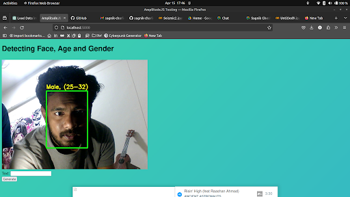
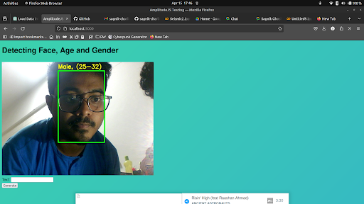
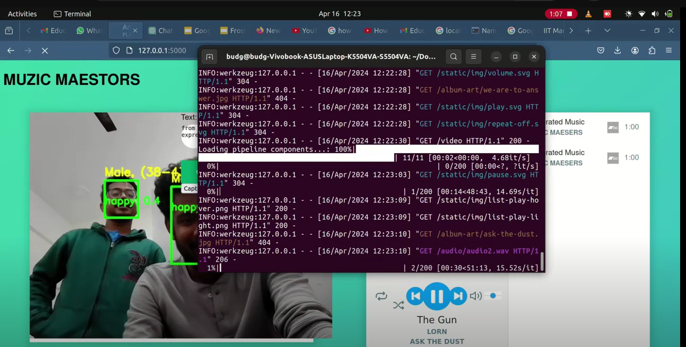
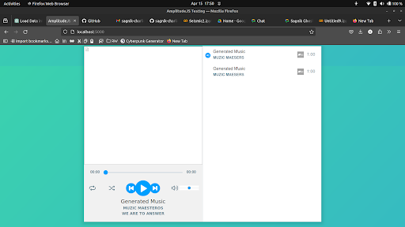
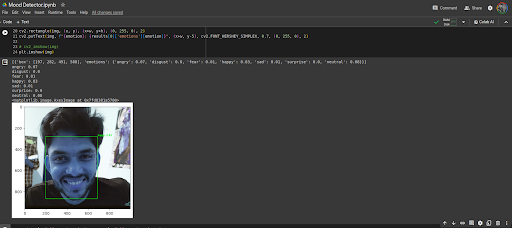
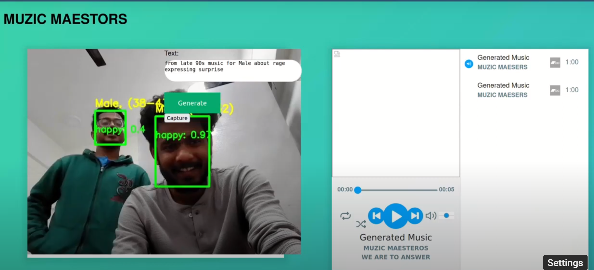

# frosthack_muzic

<p align="center">
  
  
  
  
  
  
</p>

# Steps to run the web app

Step 1. Create a python environment and activate it in the main folder <br />
Step 2. Inside the python environment upgrade pip to 23.0.1 and exceute the below command 
```
pip install --upgrade pip==23.0.1
pip install -r requirements.txt
```
Step 3. Run the web app using
```
python app.py
```

## Muzic Maesters

Generate Music that matches your vibe.
Detection of age, gender, mood(happy,sad, anger etc,), background color.
Selection of music is hard because it happens sometimes when we can not decide what to listen.So, given such condition our model can server the need to generate unique music by capturing their face thus detecting facial expression, background details. 
It can give best music based on when user is busy in activites like cooking, cleaning, driving etc.
Existing models are biased on your previous songs history and cannot give realtime and unique music.
But, our model is generating realtime music and the whole process is automated. And also user is flexible to edit the text prompt any time.